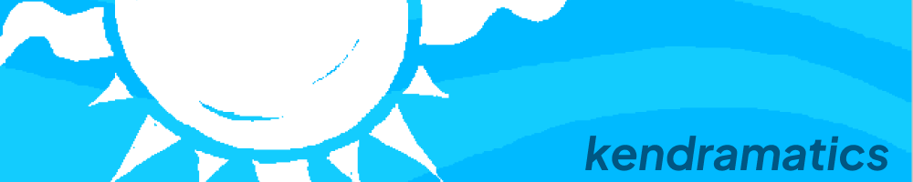

<h2>Hi there!</h2>
<ul>
  <li>My name is Kendra (she/her), and I'm from Nashville, Tennessee.</li>
  <li>I'm a recent graduate of Lehigh University's College of Engineering with a B.S. in Computer Science.</li>
  <li>I have a passion for development and design, and I'm looking for opportunities to further my expertise!</li>
  <li>I love to code! My particular interests are web dev, game dev, and artificial intelligence/machine learning.</li>
  <li>Some of my other interests and hobbies are video games, art, comics, videography, and cats.</li>
</ul>

 

<h3>Languages and Tools:</h3>

  &nbsp;
  &nbsp;
  &nbsp;
  &nbsp;
  &nbsp;
  &nbsp;
  &nbsp;
  &nbsp;
  &nbsp;
  &nbsp;
  &nbsp;
  &nbsp;
  &nbsp;
  &nbsp;

<h3>Contact:</h3>
 &nbsp;&nbsp;&nbsp;&nbsp;&nbsp;
 &nbsp;&nbsp;&nbsp;&nbsp;&nbsp;

