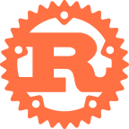

## Hi there!
* My name is Kendra (she/her), and I'm from Nashville, Tennessee.
* I'm a recent graduate of Lehigh University's College of Engineering with a B.S. in Computer Science.
* I have a passion for development and design, and I'm looking for opportunities to further my expertise!
* I love to code! My particular interests are web dev, game dev, and artificial intelligence/machine learning.
* Some of my other interests and hobbies are video games, art, comics, videography, and cats.

Languages and Tools:
  

  &nbsp;
  &nbsp;
  &nbsp;
  &nbsp;
  &nbsp;
  &nbsp;
  &nbsp;
  &nbsp;
  &nbsp;
  &nbsp;
  &nbsp;
  &nbsp;
  &nbsp;
  &nbsp;

Contact Me:
  
 &nbsp;&nbsp;&nbsp;&nbsp;&nbsp;
 &nbsp;&nbsp;&nbsp;&nbsp;&nbsp;

